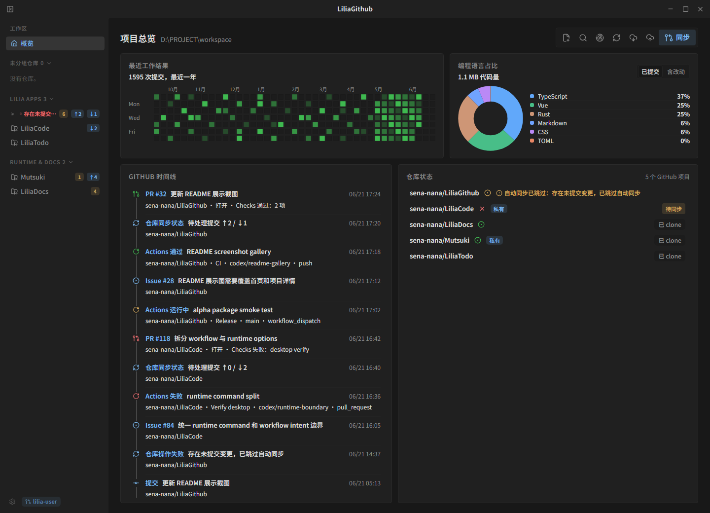
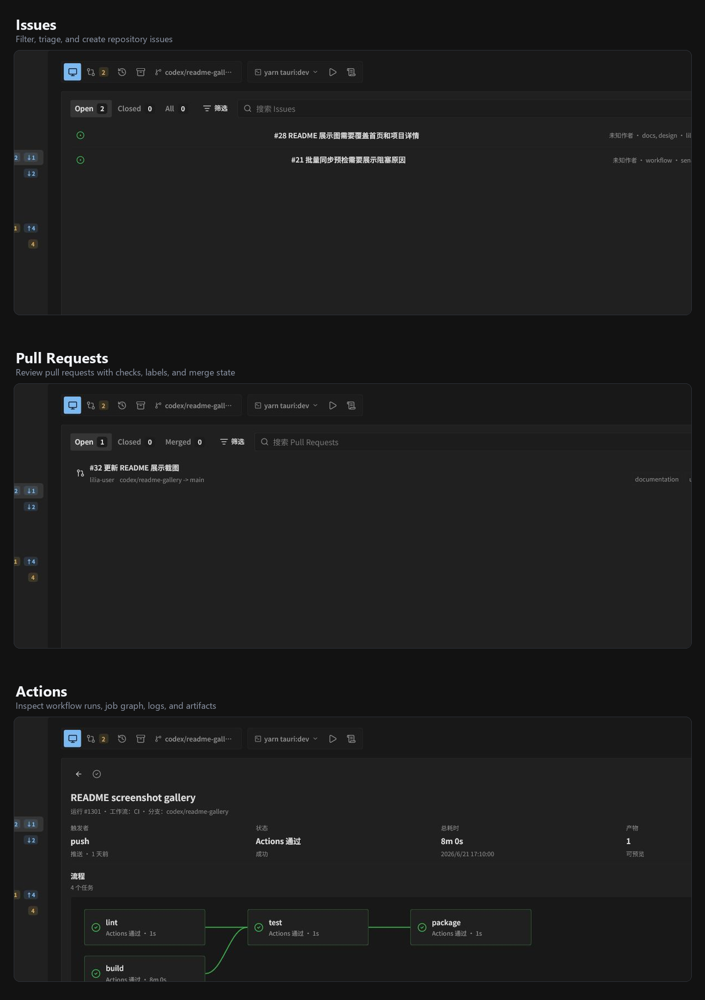

<!-- To replace README screenshots, run the frontend with VITE_README_SHOWCASE=1 and refresh .github/assets/home-overview.png plus .github/assets/repo-detail.png. The repo-detail asset should cover Issues, Pull Requests, and Actions. -->

> English | [简体中文](README.zh-CN.md) | [Documentation](https://sena-nana.github.io/LiliaGithub/)

> **Development Status**
>
> LiliaGithub is now in the 1.0 closing stability phase. Core repository workflows and GitHub collaboration views are usable; the current focus is stabilizing critical paths, filling diagnostic and recovery gaps, and completing release validation. Keep important repository work in Git and GitHub, not only in the app's local state.

<p align="center">
  
</p>

<h1 align="center">LiliaGithub</h1>

<p align="center">
  <a href="https://github.com/sena-nana/LiliaGithub/releases">
    
  </a>
</p>

<p align="center"><strong>A desktop workbench for local Git and day-to-day GitHub operations.</strong></p>

<p align="center">LiliaGithub brings local multi-repository status, focused repository operations, GitHub project visibility, personal workspace controls, and push activity tracking into one compact desktop app.</p>

<p align="center">
  
</p>

<p align="center"><strong>Workspace overview</strong></p>

<p align="center">
  
</p>

<p align="center"><strong>Repository detail: Issues, Pull Requests, and Actions</strong></p>

---

## Product Positioning

LiliaGithub is the GitHub workspace tool in the Lilia family. It is built for developers who keep many local repositories active and want to handle most everyday GitHub work without opening the web UI.

The long-term goal is a desktop-first workflow for local Git management, GitHub repository and project inspection, personal account workspace management, and push / sync activity review. The web UI remains the fallback for uncommon administration, organization policy, and advanced GitHub features that are better handled by GitHub itself.

## Milestones

- `1.0 Closing Stability`: stabilize the existing local Git, GitHub collaboration, Actions, Release, quick launch, and packaging paths, then close recovery guidance, failure diagnostics, and release validation gaps.
- `2.0 GitHub Web Parity`: align repository settings, repository surfaces, Discussions, personal configuration, and preferences with the core GitHub web experience.
- `3.0 Account Activity And Discovery`: support the GitHub account activity timeline, remote repository search, notification inbox, and cross-repository workflow aggregation.

## The Lilia Family

Lilia is a family of toolchain applications for high-collaboration engineering workflows. Its apps share a preference for observable local state, compact desktop shells, recoverable workflows, and clear human control over automation.

LiliaGithub focuses on repository operations around GitHub workspaces. It consumes LiliaUI for the desktop shell base, theme system, context menu model, shared components, and engineering-tool interaction language, but intentionally does not include LiliaCode's agent runtime, chat timeline, provider configuration, or task orchestration features.

## What Makes It Different

- Workspace-first repository view: scan a local workspace and keep repository status, branch state, changes, history, and sync state close together.
- Focused repository operations: stage, commit, pull, push, checkout, open the remote page when needed, and open the local folder from one repository surface.
- GitHub project visibility: bring repository, issue, pull request, review, release, and milestone context into the desktop app instead of requiring constant browser switching.
- Personal workspace management: provide a signed-in home for account state, repository lists, notifications, saved workspaces, and personal preferences.
- Push activity review: surface recent pushes, outgoing changes, CI / release results, and sync problems where developers already manage their repositories.
- Quick launch commands: save a repository launch target, poll running state, and inspect recent command output without turning the main workspace into a terminal-only app.
- Queued sync workflows: preflight pull / push operations and execute them in a controlled queue.
- Compact desktop workbench: keep the app quiet, dense, and readable so the repository content stays primary.

## Feature Status

The list below tracks the current real integration surface. Only capabilities that are usable as user-facing features are marked complete; partially integrated and not-yet-integrated items remain unchecked with a target milestone. Last checked: 2026-06-24.

### Local Git And Repository Management

- [x] Workspace selection and local Git repository scanning.
- [x] Repository status summary, branch information, change details, history, and repository detail view.
- [x] Single-repository staging, committing, pull, push, checkout, remote-page open, and folder open actions.
- [x] Pull / push batch preflight and queued execution.
- [x] GitHub device-code authorization and system keychain credential reuse.
- [ ] Safer conflict, failed-sync, and multi-step recovery guidance inside the app. `1.0`

### GitHub Project And Collaboration View

- [x] GitHub repository metadata, stars, forks, topics, releases, default branch state, and repository settings.
- [x] Issue browsing, filtering, detail timeline, template-assisted creation, route-persisted filters, and repository project fields.
- [x] Pull request browsing, filtering, detail timeline, checks, create flow, merge action, and route-persisted filters.
- [x] Discussion Markdown timeline rendering inside issue and pull request details.
- [x] Repository Milestones view grouped from linked issues and pull requests.
- [x] Actions run list, run detail, job graph, job logs, workflow node graph, and artifact preview.
- [x] Home GitHub timeline for recent issues, pull requests, workflow runs, pushes, and sync events.
- [x] Release list and status management.
- [ ] GitHub Discussions browsing and creation. `2.0`
- [ ] Notification inbox with repository, issue, pull request, and review filters. `3.0`
- [ ] Broader failed workflow visibility. `1.0`

### Personal Workspace

- [x] Signed-in GitHub account connection.
- [x] Local workspace preferences and theme persistence.
- [x] Account repository list access with a sidebar create-repository entry.
- [x] GitHub repository creation and clone-to-workspace flow.
- [ ] Personal home view for assigned work, recently touched repositories, and saved workspaces. `3.0`
- [ ] Watched repositories and notification preferences. `2.0`
- [ ] Local organization of favorite repositories and common workspaces. `2.0`

### Quick Launch

- [x] Repository launch candidate discovery and selection.
- [x] Saved quick launch configuration per repository.
- [x] Launch running-state polling and recent output log display.
- [ ] Clearer launch history and failure diagnostics. `1.0`

### Desktop Experience

- [x] Compact desktop shell with workspace, repository, and settings navigation.
- [x] Window position, size, and maximized-state restoration.
- [x] Light / dark theme switching.
- [x] Context menus and confirmation dialogs for repository actions.
- [ ] More complete keyboard navigation and command access for repeated GitHub work. `1.0`

### Build And Release

- [x] Windows desktop app packaging.
- [x] Contributor verification command for tests and builds.
- [x] GitHub Actions CI, documentation build, and release packaging workflow.
- [ ] Signed installers and in-app automatic updater integration. `1.0`

## Project Structure

```text
LiliaGithub/
├── docs/                       # VitePress documentation
├── scripts/                    # Contributor and Tauri helper scripts
├── src/                        # Vue 3 frontend
│   ├── components/             # GitHub business components; shared UI comes from LiliaUI
│   ├── pages/                  # Workspace, repository, and settings pages
│   ├── services/               # Frontend service and state helpers
│   ├── styles/                 # GitHub-specific style additions; shared styles come from LiliaUI
│   ├── router.ts
│   └── main.ts
├── src-tauri/                  # Tauri 2 Rust side
│   ├── icons/
│   ├── src/                    # IPC commands and desktop integration
│   └── tauri.conf.json
├── tests/                      # Vitest coverage
├── package.json
└── yarn.lock
```

## Early Development

LiliaGithub uses Yarn 4.14.1 through Corepack and pins Rust through the repository root `rust-toolchain.toml`. Enable Corepack first, then run contributor commands from the repository root through the root `yarn ...` scripts. `npm`, `pnpm`, global Yarn 1.x, and direct package-manager drift are guarded and not supported as the contributor path.

```bash
# 1) Enable Corepack and activate the repository Yarn version
corepack enable
corepack prepare yarn@4.14.1 --activate

# 2) Install dependencies
yarn install

# 3) Start only the Vite frontend
yarn dev

# 4) Start the Tauri desktop app
yarn tauri:dev

# 5) Run tests, frontend build, and Tauri Rust check
yarn verify

# 6) Start, build, or preview the documentation site
yarn docs:dev
yarn docs:build
yarn docs:preview
```

If `yarn --version` still reports `1.x` after enabling Corepack, run commands through Corepack explicitly, for example `corepack yarn install` and `corepack yarn dev`.

## First Release Packaging

Release packaging is driven by the GitHub Actions release workflow. Both CI and release jobs load Rust from `rust-toolchain.toml` before running `yarn verify` or the Tauri release action, so release validation and bundle builds use the same pinned Rust version as local development. The root `package.json`, `src-tauri/Cargo.toml`, and `src-tauri/tauri.conf.json` are aligned to the same release version, such as `1.0.0-beta.1`.

### `v1.0.0-beta.1` Notes

This release documents the `v1.0.0-beta.1` milestone and version alignment update.

- Issues and pull requests now have denser filtered lists, route-persisted filter state, template-backed creation entry points, and detail sidebars.
- Actions now has in-app run details, job logs, cleaner run lists, and a workflow node graph.
- Issue and pull request details can render discussion Markdown timelines.
- GitHub Projects metadata now degrades gracefully when `read:project` permission is unavailable instead of blocking repository collaboration views.
- The sidebar now exposes the create-repository entry, with the repository creation form split out from settings.

Pushing a `v*` tag runs verification and builds the Windows Tauri bundle for the draft release. Before publishing a release, download the artifact and manually verify install, launch, basic window behavior, repository scanning, update checks, and uninstall. Current release artifacts are Windows-first; the in-app update check only opens GitHub Releases for manual download and does not download or install updates automatically.

If Windows signing secrets are configured, the release workflow imports the PFX certificate for installer signing. Without those secrets, it still produces unsigned installers. Restoring in-app automatic updates later requires reintroducing the Tauri updater public key, private key, and updater artifact verification chain.

The Tauri icon source is [src-tauri/icons/icon.png](src-tauri/icons/icon.png).

## Thanks

- LiliaUI provides the shared desktop shell foundation, common components, theme tokens, context menu, and page/shell styles consumed by LiliaGithub.
